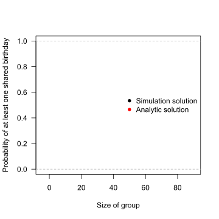

Birthday problem
====================================================

You'll recall on the first day of the course we talked about the birthday problem: 
>**In a class of N individuals, what is the probability that at least two students will share a birthday?** 

In class, we solved the problem using simulation.  Now, however, you have the tools to solve the birthday problem analytically (if we ignore leap day).

Assignment
----------

Write a blog post that explains how to solve the birthday problem with both simulation and analytic tools.  Assume that birthdays are equally likely to fall on any day of the year, ignoring leap year. Generate a plot that shows both solutions for a range of possible class sizes, say 1 to 80 as in the figure shell below. Be sure to note the pros and cons of both approaches.

The audience of your blog post is a high school student. Explain the birthday problem, and explain both solutions in a way that is accessible to a general audience.

When describing the simulation solution, use the results of the previous deliverable to help the reader understand how many replicates are needed for the simulation.

### Submission instructions

1.  Within your course repo, create a
    folder called `ec1-birthday-problem`.
2.  Within the folder, create the file `writeup.html`.  
3.  Edit the README to be an index for the portfolio.  
4.  Be prepared to share your blog post with the class when the
    deliverable is due.

### Other instructions

1.  Do not discuss this assignment with your classmates.
1.  You may only ask the instructor for help or hints.
1.  The deliverable should be your own work.