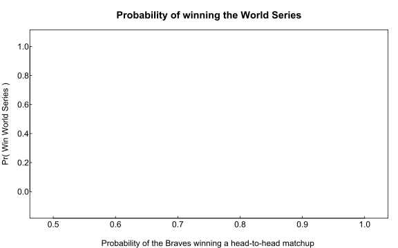
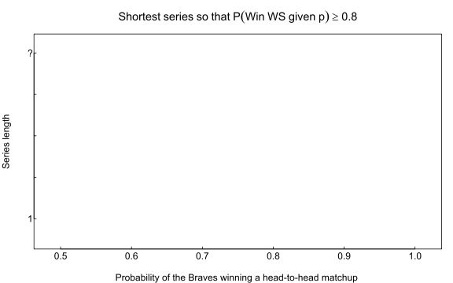

How often does the better team win the World Series?
====================================================

The world series is a *first to 4 wins* or *best of 7* match-up between the champions of the
American and National Leagues of Major League Baseball. In this
assignment, you are going to explain probability calculations related to
the world series and *first to k win* random variables.

Assignment
----------

In this assignment, you will write a blog post to answer a series of
questions related to the World Series. You will use the rules of
probability and discrete probability functions to answer the questions.
The audience of your blog post is an HR manager tasked with hiring a
data scientist. The HR manager is looking for candidates that can take a
data science concept and will explain the question and explain the
solution in a way that is accessible to a general audience. **Be sure**
to mention any assumptions of your solution.

Setup:

1.  Suppose that the Braves and the Yankees are teams competing in the
    World Series.
2.  Suppose that in any given game, the probability that the Braves win
    is *P**B* and the probability that the Yankees win is
    *P**Y* = 1 − *P**B*.

Questions to answer:

1.  Explain why the outcome of a *first to k wins* process is a bivariate random variable.  Explain the two outcomes that comprise the outcome.
1.  Derive the joint distribution of the bivariate random variable by completing a cross-table.  You may do this for a specific value of *P**B* or for *P**B* in general.
1.  What is the probability that the Braves win the World Series given
    that *P**B* = 0.55?  Identify this quantity in the cross-table.
1.  What is the probability that the Braves win the World Series given
    that *P**B* = *x*? This will be a figure (see below) with
    *P**B* on the x-axis and *P*(Braves win World Series) on
    the y-axis.
1.  Suppose one could change the World Series to be *first-to-5-wins* or some
    other *first-to-k-wins* series. What is the smallest *k* so that
    *P*(Braves win World Series\|*P**B* = .55) ≥ 0.8
1.  What is the smallest *k* so that
    *P*(Braves win World Series\|*P**B* = *x*) ≥ 0.8? This
    will be a figure (see below) with *P**B* on the x-axis
    and *k* is the y-axis.
1.  Calculate
    *P*(*P**B* = 0.55\|Braves win World Series in 7 games)
    under the assumption that either *P**B* = 0.55 or
    *P**B* = 0.45. Explain your solution.
1.  Write an `R` function which generates random draws from the bivariate distribution.  Identify what the inputs are and the structure of the outputs. Explain why such a function might be helpful. `rws <- function(n,k,p){ ... }`
1.  The home field advantage is the edge which a team may have when playing a game at its home stadium. For example, it is the edge the Braves may have over the Yankees when the head-to-head match-up is in Atlanta. It is the advantage the Yankees may have when the head-to-head match-up is in New York.  Explain how the derivation of the distribution whould change if one were to account for home field advantage.  Suppose that the schedule of games is

| Game 1 | Game 2 | Game 3 | Game 4 | Game 5 | Game 6 | Game 7 |
|:------:|:------:|:------:|:------:|:------:|:------:|:------:|
|  ATL   |  ATL   |  NYC   |  NYC   |  NYC   |  ATL   |  ATL   |

### Figure shells

### Submission instructions

1.  Within the class repo, create a
    folder called `04-first-to-k-wins`
2.  Within the folder, create an .html for your blog post
3.  **The name of the blog post file must be `writeup.html`**
4.  Within the folder, include code scripts or .rmd or some other
    document that will successfully generate the output of the
    simulation when executed from within the folder. (Do not use
    absolute file paths.)
5.  Edit the README to be an index for the portfolio. (Optional)  
6.  Be prepared to share your blog post with the class when the
    deliverable is due.